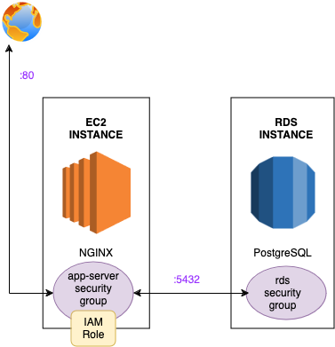

# AWS Web App

Terraform script to provision :
1. An EC2 instance with Nginx installed.
2. An RDS database (PostgreSQL).
3. A public endpoint to access the Nginx website.
 
You will be able to access the NGINX default page by entering the public ip of the app in the browser.

[](Architecture)
## Requirements
- Terraform installed 
- Export your AWS credentials locally:
```
$ export AWS_ACCESS_KEY_ID=
$ export AWS_SECRET_ACCESS_KEY=
```

- create a terraform.tfvars file in app/:

```
db_username = ""
db_pw       = ""
db_name     = ""
```

- in app/
```
terraform init
terraform apply
```


### Resources
https://developer.hashicorp.com/terraform/tutorials/aws-get-started/aws-build
https://docs.aws.amazon.com/IAM/latest/UserGuide/access_policies.html
